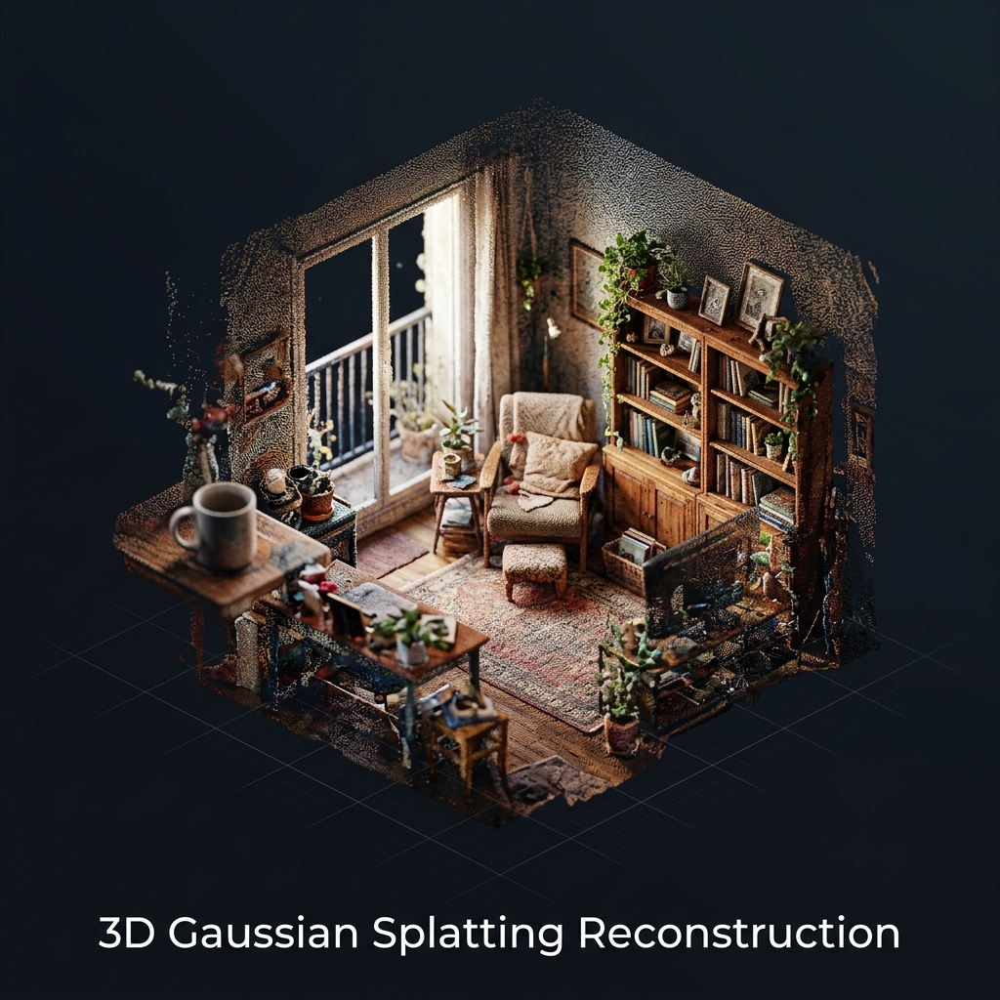
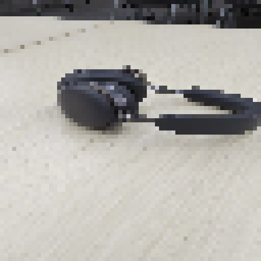
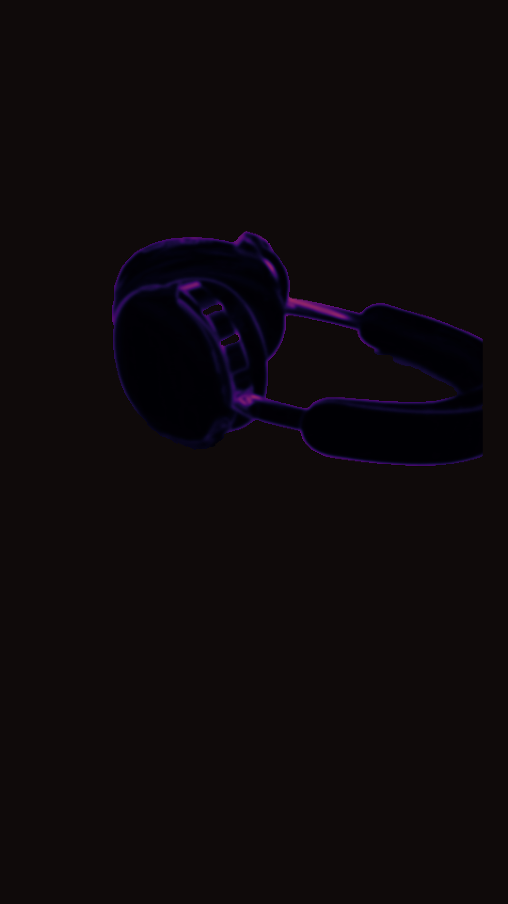
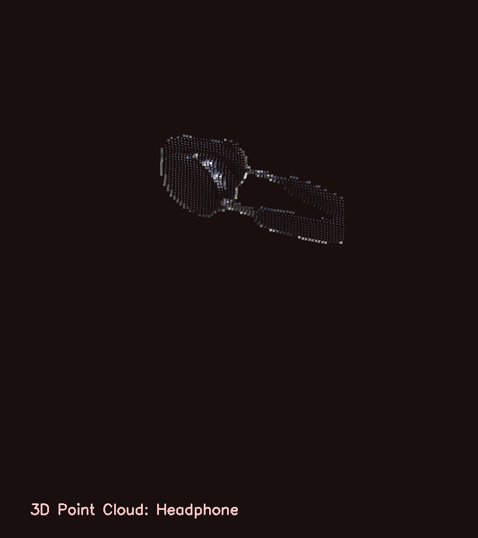
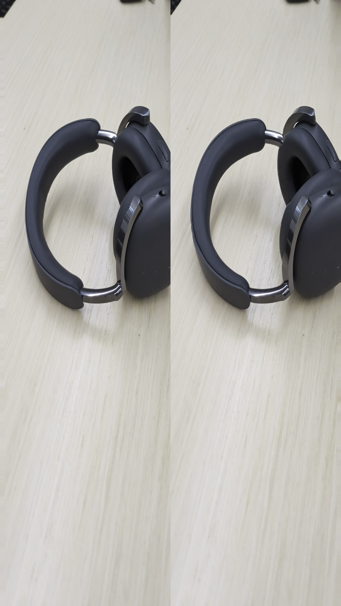

# 🎧 Hackathon: Advancing 3D Reconstruction and Stereoscopic Visualization

**Contact:** gogazago@google.com

---

## 🌟 Project Description

This project implements an end-to-end pipeline that transforms **2D video of a real-world object** (headphones) into immersive **3D reconstructions** and **stereoscopic visualizations**. By combining frame extraction, pixel-by-pixel analysis, depth estimation, and 3D point cloud rendering, we demonstrate a scalable approach to volumetric media creation — suitable for viewing on **Google Cardboard**.

### Hero Preview: 3D Gaussian Splatting Reconstruction



---

## 📂 Project Structure

```
changbal_hackathon/
├── README.md                  # This file
├── LICENSE                    # Project license
├── extract_frames.py          # Main pipeline script (auto-discovers objects)
├── create_3d_video.py         # 3D floating rotating video generator
├── video/                     # ← Source videos organized by object
│   ├── banana/
│   │   └── PXL_20260620_172028913.mp4   # Banana + water bottle (~20s)
│   └── headphone/
│       └── video_headphone.mp4          # Headphones on desk (~9s)
└── pixel_frames/              # ← All generated outputs (per object)
    ├── banana/
    │   ├── banana_3d_reconstruction.mp4          # Standard 3D rotating showcase (1080x1080)
    │   ├── banana_3d_reconstruction_cardboard.mp4 # Cardboard SBS 3D rotating showcase (2160x1080)
    │   ├── frames/                # 63 extracted key frames
    │   ├── pixel_grid/            # Pixel-by-pixel block visualizations
    │   ├── depth_maps/            # Gradient-based depth estimations
    │   └── 3d_renders/            # 3D point cloud renders + stereo
    └── headphone/
        ├── headphone_3d_reconstruction.mp4          # Standard 3D rotating showcase (1080x1080)
        ├── headphone_3d_reconstruction_cardboard.mp4 # Cardboard SBS 3D rotating showcase (2160x1080)
        ├── frames/                # 28 extracted key frames
        ├── pixel_grid/            # Pixel-by-pixel block visualizations
        ├── depth_maps/            # Gradient-based depth estimations
        └── 3d_renders/            # 3D point cloud renders + stereo
```

---

## 🎬 Pipeline Overview

The reconstruction pipeline consists of **5 stages**, each building on the previous. It **auto-discovers** all object folders under `video/` (e.g. `video/headphone/`) and creates matching output under `pixel_frames/<object>/`:

### Stage 1: Frame Extraction

Extracts **28 key frames** at regular intervals from the source video (every 10th frame out of 274 total).

| Property | Value |
|----------|-------|
| Resolution | 1080 × 1920 (portrait) |
| Frame Rate | 29.99 fps |
| Total Frames | 274 |
| Duration | ~9.1 seconds |
| Extracted Frames | 28 |

### Stage 2: Pixel-by-Pixel Visualization

Each frame is downscaled to a **64×64 pixel grid** and then enlarged using nearest-neighbor interpolation. This reveals the individual pixel color blocks that make up the image — essential for understanding how pixel data maps to 3D space.



### Stage 3: Depth Map Estimation

Depth is estimated from each frame using **Sobel gradient operators** and Gaussian smoothing. The result is visualized with the **Inferno colormap** — brighter regions indicate stronger depth edges.



### Stage 4: 3D Point Cloud Rendering

Each frame's pixels are projected into **3D space** using an isometric projection. Depth is estimated from a combination of:
- **Luminance** (brighter pixels → closer to camera)
- **Center-weighting** (center of frame → closer)

Points are sorted back-to-front and rendered as colored blocks on a dark canvas.



### Stage 5: Stereoscopic Pair (Google Cardboard)

A side-by-side stereoscopic image is generated from the middle frame for **Google Cardboard** viewing:
- **Left eye** and **Right eye** views with depth-based horizontal displacement
- 64mm Inter-Pupillary Distance (IPD) simulation
- Each eye occupies 50% of the viewport



### Stage 6: Floating 3D Video Generation

Removes all background elements (like tables, chairs, water bottles) to isolate only the target object (headphones or banana). Projects the isolated pixels into 3D using the depth map, and renders them as a volumetric point cloud floating in dark space. The final output is generated in **two formats**:
1. **Standard Format:** An MP4 video showing the camera rotating 360° around the isolated object.
2. **Google Cardboard SBS Format:** A Side-by-Side (SBS) stereoscopic MP4 video. Renders Left and Right eye channels with dual virtual cameras offset by a 64mm IPD equivalent disparity, allowing real-time stereoscopic depth viewing when played in a Cardboard viewer.

- **Background Removal:** Mask-initialized GrabCut segmentation.
- **Renderer:** Custom Y-axis rotational projection with depth-scaled point sizes on a charcoal background.
- **Outputs:** 
  - Standard: `pixel_frames/<object>/<object>_3d_reconstruction.mp4`
  - Cardboard: `pixel_frames/<object>/<object>_3d_reconstruction_cardboard.mp4`

---

## 🏗 Project Scope

| Phase | Objective | Key Technology |
|-------|-----------|----------------|
| Phase 1 | Video to 3D Rendering | Neural Radiance Fields (NeRF) / 3D Gaussian Splatting |
| Phase 2 | 3D Rendering to Stereoscopic View | Binocular disparity rendering (Left/Right eye projection) |

## 🔬 Technical Roadmap

### 1. Video to 3D Rendering

- **Data Pre-processing:** Frame extraction and camera pose estimation using Structure-from-Motion (SfM).
- **Optimization:** Utilizing 3D Gaussian Splatting for high-fidelity scene representation.
- **Challenge:** Managing temporal consistency and occlusions within dynamic scenes.

### 2. Stereoscopic Integration for Google Cardboard

To enable viewing on Google Cardboard, the pipeline will implement the following:

- **Virtual Camera Setup:** Implementing dual virtual cameras with a 64mm Inter-Pupillary Distance (IPD) offset.
- **Viewport Configuration:** Rendering the Left Eye view to the left 50% of the display and the Right Eye view to the right 50%.
- **Distortion Correction:** Applying a "barrel distortion" shader to compensate for the spherical lenses in the Cardboard headset, ensuring a corrected, linear image.
- **Projection Strategy:** Utilizing parallel projection to minimize vertical parallax and reduce user eye strain.

---

## 🚀 How to Run

### Prerequisites

```bash
pip3 install opencv-python-headless Pillow numpy
```

### Run the Pipeline

```bash
# Step 1: Extract frames and generate static 3D/stereo renders
python3 extract_frames.py

# Step 2: Generate floating 3D video for an object
python3 create_3d_video.py headphone
python3 create_3d_video.py banana
```

1. **`extract_frames.py`** automatically discovers all object folders under `video/` and generates static outputs.
2. **`create_3d_video.py`** takes the object folder name as an argument, segments the object out of the background, and generates a rotating 3D `.mp4` video.

### Adding a New Object

To add a new object, simply create a folder under `video/` with a video file inside:

```bash
mkdir video/my_new_object
cp my_video.mp4 video/my_new_object/
python3 extract_frames.py
```

---

## 📊 Evaluation Metrics

- **Visual Fidelity:** SSIM (Structural Similarity Index) and PSNR comparisons.
- **Rendering Latency:** Frames-per-second (FPS) output for real-time stereoscopic visualization.
- **Spatial Accuracy:** Precision of depth reconstruction in the final stereo pair.

---

## 📝 License

See [LICENSE](LICENSE) for details.
